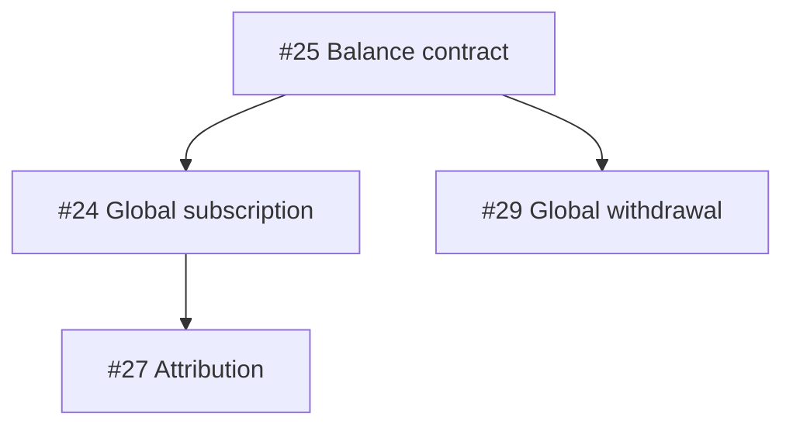

# Orchestrate Issues

Coordinate multiple implementation agents without letting parallelism violate dependency, migration, or integration constraints.

The issue tracker is the source of truth. Prefer explicit GitHub issue dependencies over dependencies that exist only in prose.

This skill is a scheduler and integrator. It does **not** replace `/implement`, `/tdd`, or `/code-review`.

## Invariants

Always preserve these invariants:

1. One issue = one implementation context = one worktree/branch = one PR.
2. A hard dependency is satisfied only after its upstream issue is merged and its required gate is green.
3. Never assign a blocked issue merely because its blocker has code in an unmerged branch.
4. Recalculate the execution frontier after every merge, newly discovered blocker, failed gate, or scope change.
5. Treat waves as a visualization only. Never wait for an entire wave if a worker is free and another safe frontier issue exists.
6. Never infer away a migration hazard. If uncertain whether two changes collide at the database layer, serialize migration finalization.
7. Never edit historical migrations to resolve concurrent work.
8. Never choose destructive data-conflict winners automatically.
9. Do not silently invent dependencies. Report newly inferred dependencies and record them in the tracker when the user permits tracker mutation.
10. Optimize for correctness first, then useful parallelism. Do not parallelize merely to keep every worker busy.

Read [dependency-model.md](references/dependency-model.md) before computing a plan that contains more than trivial independent issues.

Read [migrations.md](references/migrations.md) whenever any issue may touch database schema, migration files, backfills, constraints, or persisted financial/accounting state.

Read [status-model.md](references/status-model.md) when assigning or advancing issue state.

## Inputs

Use the current repository and issue tracker. Determine:

- open issues in scope;
- issues explicitly excluded from the run;
- direct `blocked by` / `blocking` relationships;
- dependencies stated in issue bodies, specs, acceptance criteria, or linked issues;
- transitive dependencies derived from the direct graph;
- files/modules likely touched by each issue;
- issues that may alter database schema or require backfill;
- cross-cutting contracts established by one issue and consumed by others;
- human-only tasks;
- final integration/E2E gates;
- maximum worker concurrency requested by the user.

If concurrency is unspecified, default to 3 implementation workers plus 1 integrator.

Do not ask the user to restate information available in the repo or issue tracker.

## Process

### 1. Build the issue graph

For every issue in scope, capture:

- issue number and short title;
- current status;
- direct blockers;
- direct dependents;
- transitive blockers;
- contract dependencies;
- likely collision domains;
- migration risk: `none`, `schema`, `data`, or `schema+data`;
- execution class: `agent`, `human`, or `gate`.

Normalize dependency direction as:

`A -> B` means **A must be satisfied before B may start**.

Detect cycles. If the hard-dependency graph contains a cycle, stop scheduling the affected component and report the cycle.

### 2. Classify relationships

Classify each relationship as one of:

- `hard`: downstream work must not start before upstream is satisfied;
- `contract`: downstream depends on an API/schema/domain contract established upstream;
- `migration`: implementation may proceed, but migration finalization must be serialized;
- `collision`: work may proceed in parallel, but overlapping files/modules require ordered merge/rebase;
- `gate`: downstream release/completion depends on an integrated validation;
- `human`: requires human action and must not consume an agent worker.

Never collapse `collision` into `hard` unless simultaneous implementation would make one branch semantically invalid.

### 3. Compute the current frontier

An issue is `READY` only when all are true:

- it is in scope;
- it is not already claimed;
- every `hard` and `contract` blocker is satisfied;
- no required human prerequisite is outstanding;
- no active exclusive lock forbids starting it;
- starting it does not violate an explicit project rule.

Sort READY issues by:

1. issues that unlock the largest number of downstream issues;
2. foundational contracts;
3. migration/schema prerequisites;
4. integration-critical path;
5. lower collision risk;
6. ordinary independent work.

Do not treat this priority as permission to violate dependencies.

### 4. Assign workers

Assign at most one issue per worker.

For each assignment output:

- worker;
- issue;
- why it is ready;
- blockers already satisfied;
- expected collision domains;
- migration classification;
- branch/worktree name;
- merge prerequisites.

Default branch convention:

`codex/issue-<number>-<slug>`

Immediately mark/claim the issue as `In Progress` when tracker mutation is available.

A worker must not self-select a different issue without returning control to the orchestrator.

### 5. Migration lock

If an issue can alter database schema or migration artifacts, apply the migration protocol from [migrations.md](references/migrations.md).

There are two separate concepts:

- **schema work**: agents may modify declarative schema files required by their issue;
- **migration finalization**: exclusive operation owned by one issue/integrator at a time.

Only the holder of the migration lock may create or modify:

- migration SQL;
- migration journal;
- migration snapshots;
- generated migration metadata.

Do not hold the migration lock for the full implementation duration. Acquire it only for migration finalization after rebasing onto current `main`.

### 6. Worker completion gate

An implementation worker returns one of:

- `PR_READY`
- `BLOCKED`
- `FAILED`

`PR_READY` must include:

- PR/branch reference;
- tests run;
- typecheck/build status where applicable;
- migration impact;
- discovered dependencies;
- discovered collisions;
- unresolved risks.

A worker discovering a new hard dependency must stop the affected implementation rather than coding around the missing prerequisite.

### 7. Integrate

For each `PR_READY` issue:

1. verify declared dependencies are still satisfied;
2. determine merge order;
3. if migration-bearing, acquire migration lock;
4. rebase onto current `main`;
5. regenerate final migration from consolidated schema when project tooling requires generated migrations;
6. audit migration/backfill;
7. run issue-specific validation;
8. run required integration gate;
9. merge;
10. mark dependency satisfied;
11. release migration lock;
12. recalculate the frontier immediately.

A blocker is not satisfied merely because a PR is open or approved.

Default satisfaction rule:

`MERGED + REQUIRED CI/GATE GREEN`

Projects may define a stronger rule.

### 8. Continue until stop condition

Continue dispatching newly READY issues while:

- worker capacity exists;
- safe work exists;
- no user-defined stop condition has been reached.

Stop and report when:

- all in-scope issues are complete;
- only blocked/human/deferred issues remain;
- a dependency cycle is found;
- migration/data preflight requires a human decision;
- an integration gate fails and invalidates downstream scheduling.

## Output

Always produce these sections when planning or reporting an orchestration run:

### Frontier

Current safe-to-start issues.

### Active workers

A compact table with worker, issue, state, migration risk, and merge constraints.

### Dependency graph

Use Mermaid when useful.

Use solid arrows for hard/contract dependencies.

Example:

Annotate non-hard relationships explicitly rather than pretending they are graph blockers.

### Locks and gates

Show:

- migration lock owner;
- integration gate currently pending;
- human-lane prerequisites;
- deferred production actions.

### Next dispatch

State what becomes eligible after each likely next merge.

## Anti-patterns

Never:

- execute fixed waves as global barriers;
- run every open issue in parallel;
- let two agents finalize migrations concurrently;
- stack downstream work on an unmerged blocker unless the user explicitly requests stacked PRs;
- use `drizzle-kit push` or equivalent schema-push shortcuts when the project requires migration history;
- hand-edit generated journals/snapshots to settle branch conflicts;
- edit already-applied historical migrations;
- auto-resolve conflicting production data by picking an arbitrary winner;
- mark an issue `Done` before its required integration gate;
- leave a newly discovered dependency only in chat when it can be represented in the tracker;
- use the integrator as an ordinary fourth implementation worker while coordination work is pending.

## Relationship to implementation skills

Typical flow:

`/to-tickets -> /orchestrate-issues -> /implement -> /code-review -> PR -> integrate -> recalculate frontier`

For each dispatched issue, use a fresh context and invoke the implementation skill appropriate to that ticket.
