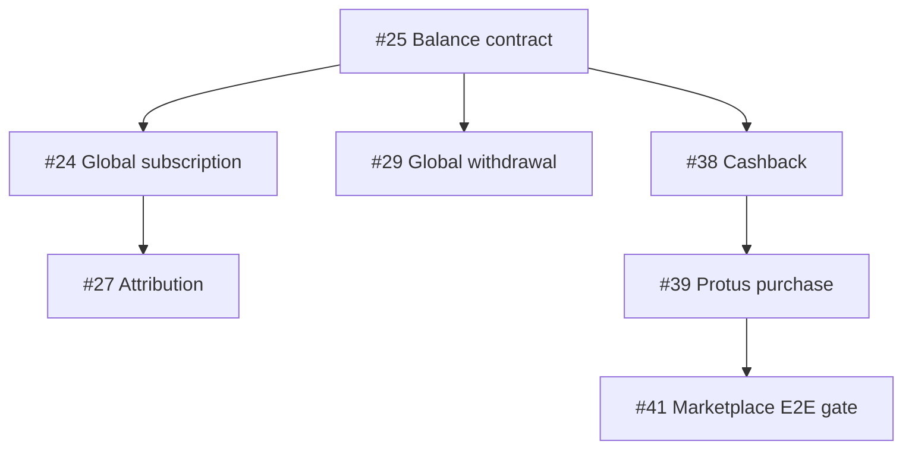

# Example Orchestration

Assume three workers and these relationships:

- #25 establishes balance states.
- #24, #29, #38 consume #25.
- #24 establishes global membership.
- #27 consumes #24.
- #26 and #32 are initially independent.
- #25 and #33 both contain migration work.
- #43 is human-only.
- #41 is the final marketplace gate.

## Hard graph



## Initial frontier

```text
READY: #25, #26, #32, #33
workers: 3
```

A reasonable dispatch is:

| Worker | Issue | Why |
|---|---|---|
| A | #25 | Foundational contract; unlocks several issues |
| B | #26 | Independent |
| C | #32 | Independent |

#33 remains READY.

If B finishes #26 before A finishes #25, B may immediately claim #33. There is no wave barrier.

If #33 reaches migration finalization while #25 is also migration-bearing:

- implementation may overlap;
- only one obtains the migration lock;
- the other waits at migration finalization, not during all coding.

When #25 merges and its required gates pass, recalculate:

```text
new READY may include: #24, #29, #38
```

Dispatch based on available workers and collision domains.
